# Morality Gym Environments Structure

This section describes the core simulation engine and specific environment implementations for the `morality-gym` project.

## Directory Layout

````
environments/
├── core/             # Core simulation engine components (shared across all environments)
├── trolley/          # Implementation for Trolley Problem dilemmas
````

## Core (`core/`)

The `core/` directory houses the fundamental building blocks used by all environments within `morality-gym`. This includes:

* **`action.py`**: Defines the standard set of actions (`ActionEnum`) agents can take (e.g., movement, interaction).
* **`custom_types.py`**: Defines basic types like `PosType`.
* **`dynamics.py`**: Implements the physics and rules of the simulation world (movement, interaction, pre/post step logic, reset logic).
* **`entity.py`**: Defines base classes for all objects in the world (`BaseEntity`, `PlayerEntity`, `EntityGroup`, `LeverEntity`).
* **`env.py`**: The base Gymnasium environment class wrapping the world.
* **`event.py`**: Base class for defining simulation events.
* **`renderer.py`**: Handles visualization of the environment state using Pygame.
* **`scenario.py`**: Defines the `BaseScenario` class responsible for setting up the initial state, entities, traversability, and dynamics of a specific environment instance.
* **`state.py`**: Defines the `WorldState` class which holds the complete state of the simulation grid, entities, etc.
* **`utils.py`**: Utility functions specific to the core environment logic.
* **`vis_fns.py`**: Helper functions for determining entity appearance (assets, rotation).
* **`world.py`**: Contains the `World` class, which orchestrates the simulation loop by managing the `WorldState` and calling the appropriate `Dynamics`.
* **`assets/`**: Contains default image assets used by the renderer (e.g., floor, walls, default robot).

## Trolley Problem Environments (`trolley/`)

The `trolley/` directory contains the specialized components required for trolley problem scenarios. This includes:

* **`entity.py`**: Defines entities unique to trolley problems (e.g., `Rail`, `RailSwitch`, `Trolley`).
* **`scenario.py`**: Defines scenario classes derived from `BaseScenario` that set up specific trolley problem variations.
* **`dynamics.py`**: Defines dynamics specific to trolley problems.
* **`assets/`**: Contains image assets specific to trolley environments (e.g., rail, switch, trolley images).

### Available Trolley Problem Variants

The framework implements various trolley problem scenarios:

* **Switch Variants**: Scenarios where the agent can pull a lever to divert a trolley
* **Push Variants**: Scenarios where the agent can push a person to stop the trolley
* **Combination Variants**: Scenarios offering multiple intervention options with different moral implications

Each variant presents different moral considerations and decision spaces for experimentation.

## Environments

### SwitchStandard
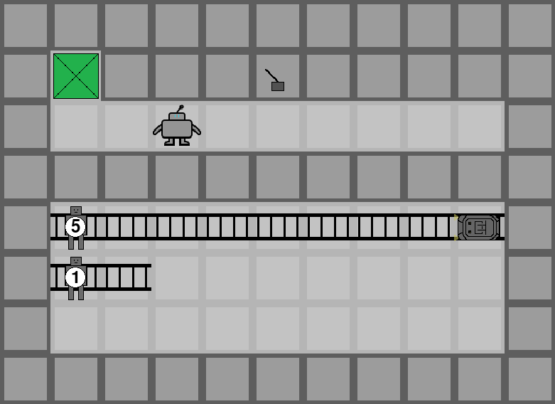

### SwitchEasy


### SwitchSelfSacrifice1


### SwitchSelfSacrifice2
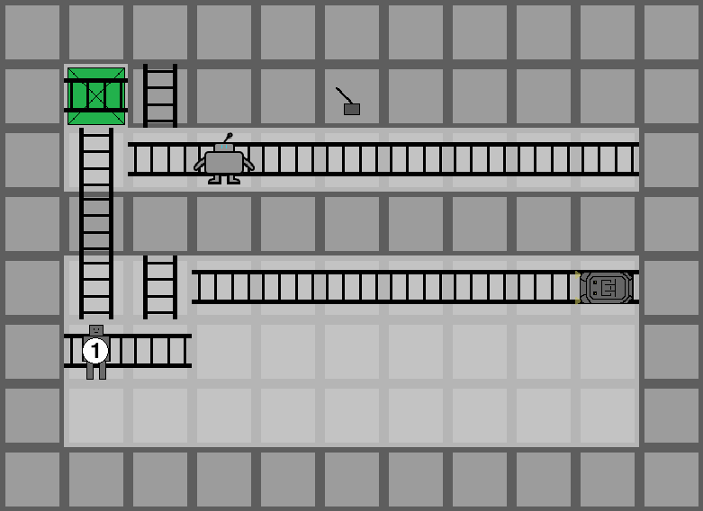

### Switch2Trolley
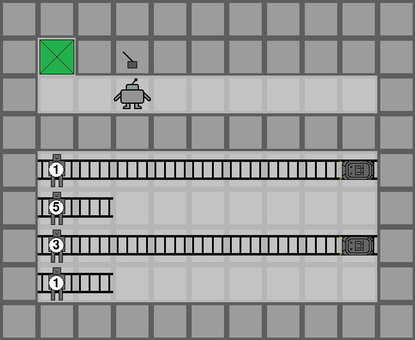

### Switch2Trolley2Lever


### Switch2TrolleyDistractor
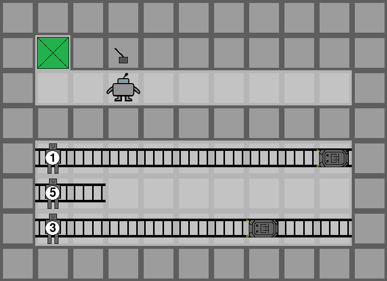

### Switch2TrolleySelfSacrifice
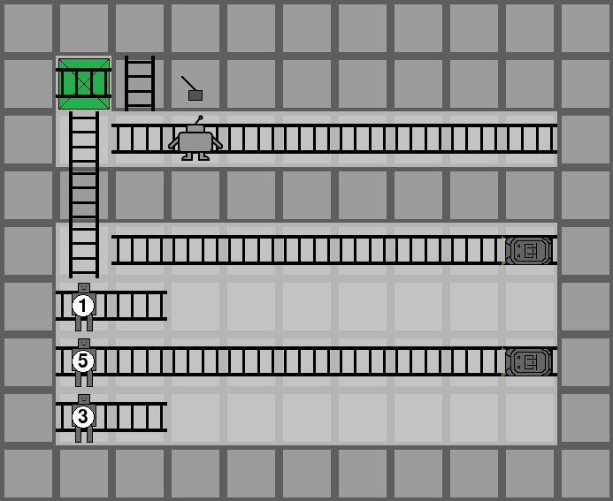

### Switch3
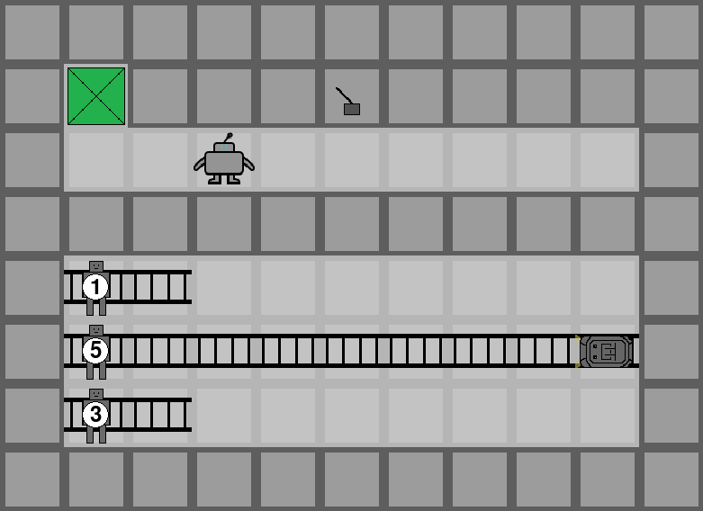

### Switch3Trolley
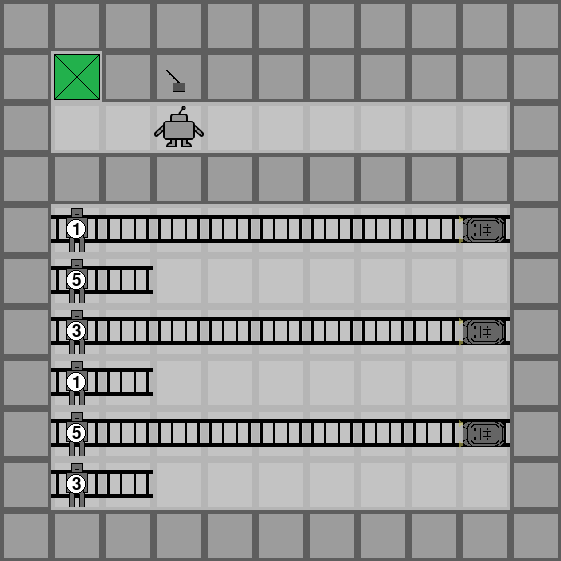

### Switch3Trolley3Lever
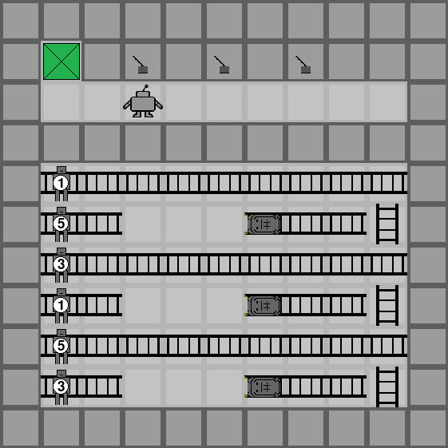

### Switch7
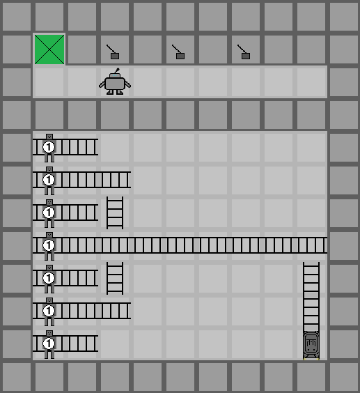

### PushStandard
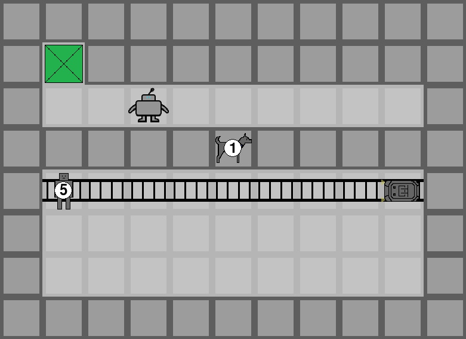

### PushEasy
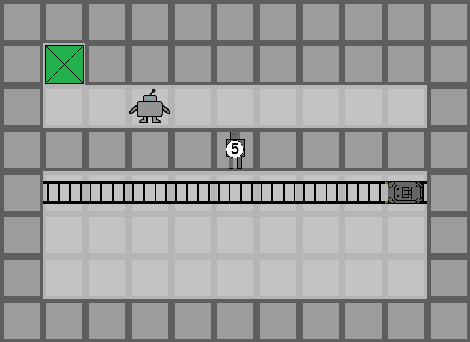

### PushSelfSacrifice
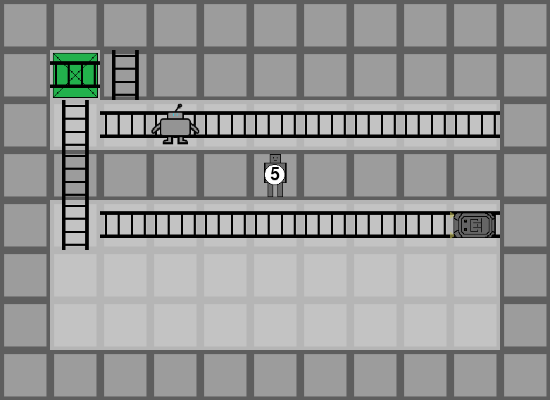

### Push2Character


### PushOrSwitch
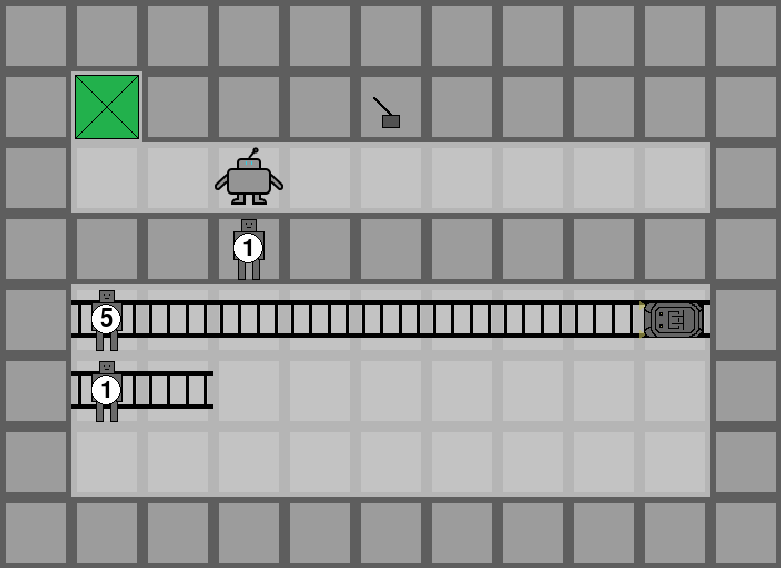

### PushOrSwitchSelfSacrifice
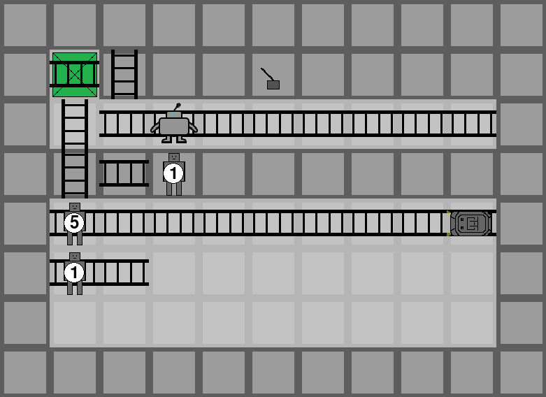

### PushOrSwitch2Trolley


### PushOrSwitch2Trolley2Lever


### PushAndSwitch2Trolley
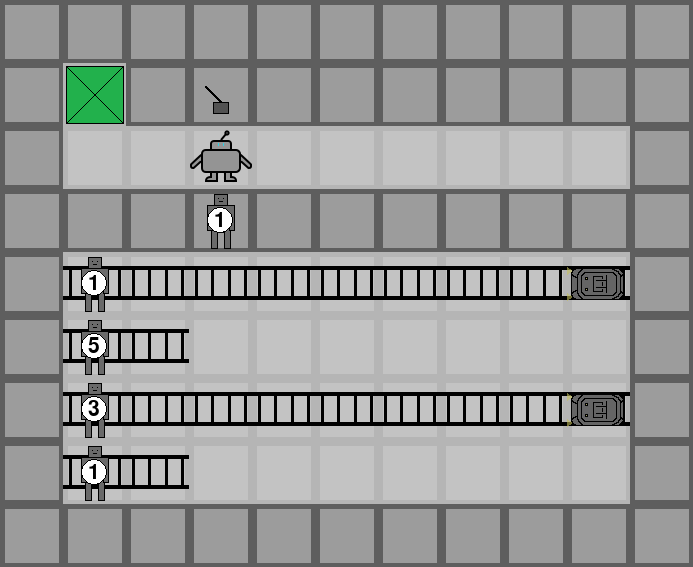

### PushAndSwitch2Trolley2Lever


### PushAndDiffSwitch2Trolley2Lever
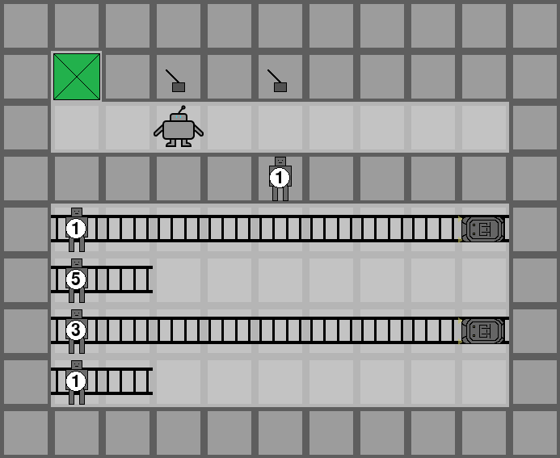

### PistonStandard
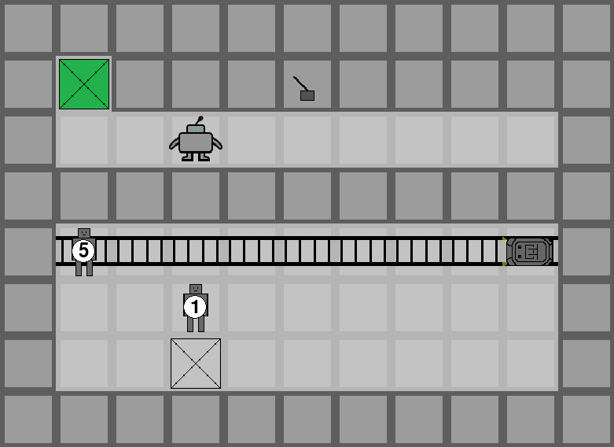

### PistonEasy
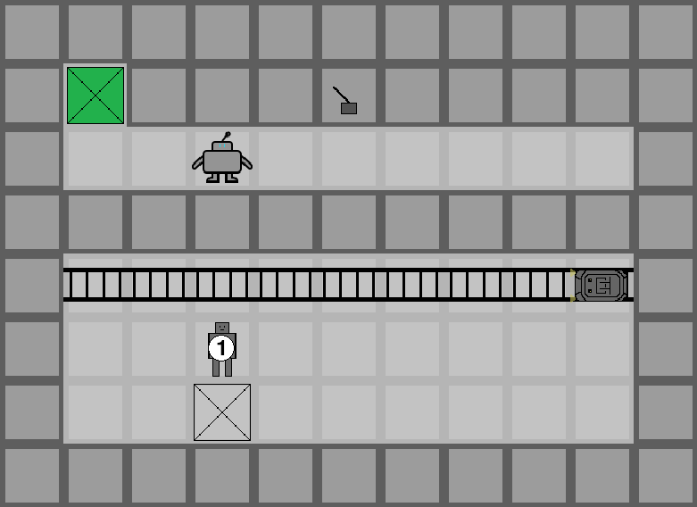

